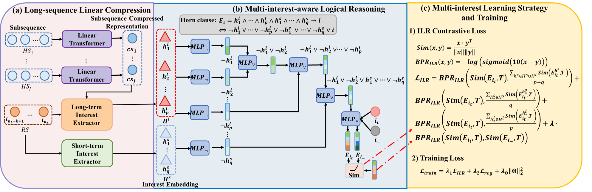

# Multi-Interest Logical Reasoning Recommendation Based on Long Sequence Linear Compression
## Abstract
> Logical reasoning-based recommendation methods construct logical expressions from items in short sequences by leveraging logical operators and incorporating regularization terms to ensure adherence to logical rules, thereby improving recommendation accuracy. However, existing methods suffer from several limitations: 1) The high time complexity of logical reasoning and rule learning, which scales with the number of interactive items, hinders their effectiveness in addressing long-sequence recommendation problems; 2) They focus exclusively on single user interests in short sequences, neglecting the multi-aspect interests of users in long sequences (e.g., long-term and short-term interests), leading to incomplete user preference representations. We propose a novel multi-interest logical reasoning framework based on a long-sequence linear compression strategy to address these limitations. This strategy leverages a linear Transformer model to compress many long-term interaction items into a compact set of subsequence representations, significantly reducing the time complexity of logical reasoning. Furthermore, we design a multi-interest learning strategy to capture users' long-term and short-term interests and incorporate these multi-aspect interests during logical reasoning, enhancing user interest representations' completeness and improving recommendation accuracy. Experimental results on four real-world datasets show that our method significantly outperforms all baselines regarding computing efficiency and recommendation accuracy, validating its effectiveness.

<center>

</center>

## Running the Experiments

### 1. Environment

+ PyTorch 1.12.1+cu113
+ scikit-learn 0.23.1
+ scipy 1.10.1
+ RTX 3090
+ Memory 128G

You can also install dependencies by

```bash
pip install -r requirements.txt
```

### 2. Dataset

| Dataset  | ML-1M   | MoTV    | Amazon(500) | Amazon(1000)     |
|----------|---------|---------|-------------|-----------|
| #User    | 1,594   | 1,234   | 1,330     | 236    |
| #Item    | 2,054   | 20,773  | 238,289      | 66,031    |
| #Inter   | 248,220 | 264,282 | 1,209,798   | 367,468 |
| #MedLen  | 91.0    | 148.5   | 683.5         | 1,339.0      |
| Sparsity | 92.42%  | 98.97%  | 99.62%       |99.06%    |

 We conduct extensive experiments on four public datasets to compare the recommendation accuracy of nine methods. These datasets include [ML-1M Dataset](https://grouplens.org/datasets/movielens/), MoTV, Amazon-500, and Amazon-1000. Each dataset contains user IDs, item IDs, and ratings. The MoTV, Amazon(500), and Amazon(1000) datasets can be obtained from [Amazon Review Data (2018)](https://nijianmo.github.io/amazon/index.html). For the ML-1M and MoTV datasets, we select users with more than 50 and 100 interactions, respectively, resulting in the creation of the subsets ML-1M(50), ML-1M(100), MoTV(50), and MoTV(100). The Amazon(500) and Amazon(1000) datasets filter users with more than 500 and 1000 interactions, respectively.


## Train
* ML-1M and MoTV (#Seq = 100, Subsequence Length = 30)
```bash
> cd ./src/
> # args.ML_num: [5,7,9] args.short_ML_num: [5,7,9]
> # ML-1M dataset
> python MI_no_rule_main_length_no_preference_LS_Linear30_Transformer.py --rank 1 --model_name NCR --load = 0 --train = 1 --optimizer GD --lr 0.001 --dataset ML-1M --ML_num 7 --short_ML_num 7 --ML_model 'SA_LS_LinFormer30'  --metric ndcg@5,ndcg@10,hit@5,hit@10 --max_his 100 --test_neg_n 100
> # MoTV dataset
> python MI_no_rule_main_length_no_preference_LS_Linear30_Transformer.py --rank 1 --model_name NCR --load = 0 --train = 1 --optimizer GD --lr 0.001 --dataset Movies_and_TV_100 --ML_num 7 --short_ML_num 7 --ML_model 'SA_LS_LinFormer30'  --metric ndcg@5,ndcg@10,hit@5,hit@10 --max_his 100 --test_neg_n 100
```
* Amazon(500) (#Seq = 500, Subsequence Length = 70)
```bash
> cd ./src/
> # args.ML_num: [5,7,9] args.short_ML_num: [5,7,9]
> python MI_no_rule_main_length_no_preference_LS_Linear70_Transformer_500.py --rank 1 --model_name NCR --load = 0 --train = 1 --optimizer GD --lr 0.001 --dataset Amazon_500 --ML_num 9 --short_ML_num 9 --ML_model 'SA_LS_LinFormer70'  --metric ndcg@5,ndcg@10,hit@5,hit@10 --max_his 500 --test_neg_n 100
```
* Amazon(1000) (#Seq = 1000, Subsequence Length = 330)
```bash
> cd ./src/
> # args.ML_num: [5,7,9] args.short_ML_num: [5,7,9]
> python MI_no_rule_main_length_no_preference_LS_Linear330_Transformer_1000.py --rank 1 --model_name NCR --load = 0 --train = 1 --optimizer GD --lr 0.001 --dataset Amazon_1000 --ML_num 7 --short_ML_num 7 --ML_model 'SA_LS_LinFormer330'  --metric ndcg@5,ndcg@10,hit@5,hit@10 --max_his 1000 --test_neg_n 100
```

## Test
* ML-1M and MoTV (#Seq = 100, Subsequence Length = 30)
```bash
> cd ./src/
> # args.ML_num: [5,7,9] args.short_ML_num: [5,7,9]
> # ML-1M dataset
> python MI_no_rule_main_length_no_preference_LS_Linear30_Transformer.py --rank 1 --model_name NCR --load = 1 --train = 0 --optimizer GD --lr 0.001 --dataset ML-1M --ML_num 7 --short_ML_num 7 --ML_model 'SA_LS_LinFormer30'  --metric ndcg@5,ndcg@10,hit@5,hit@10 --max_his 100 --test_neg_n 100
> python MI_no_rule_main_length_no_preference_LS_Linear30_Transformer.py --rank 1 --model_name NCR --load = 1 --train = 0 --optimizer GD --lr 0.001 --dataset Movies_and_TV_100 --ML_num 7 --short_ML_num 7 --ML_model 'SA_LS_LinFormer30'  --metric ndcg@5,ndcg@10,hit@5,hit@10 --max_his 100 --test_neg_n 100
```
* Amazon(500) (#Seq = 500, Subsequence Length = 70)
```bash
> cd ./src/
> # args.ML_num: [5,7,9] args.short_ML_num: [5,7,9]
> python MI_no_rule_main_length_no_preference_LS_Linear70_Transformer_500.py --rank 1 --model_name NCR --load = 1 --train = 0 --optimizer GD --lr 0.001 --dataset Amazon_500 --ML_num 9 --short_ML_num 9 --ML_model 'SA_LS_LinFormer70'  --metric ndcg@5,ndcg@10,hit@5,hit@10 --max_his 500 --test_neg_n 100
```
* Amazon(1000) (#Seq = 1000, Subsequence Length = 330)
```bash
> cd ./src/
> # args.ML_num: [5,7,9] args.short_ML_num: [5,7,9]
> python MI_no_rule_main_length_no_preference_LS_Linear330_Transformer_1000.py --rank 1 --model_name NCR --load = 1 --train = 0 --optimizer GD --lr 0.001 --dataset Amazon_1000 --ML_num 7 --short_ML_num 7 --ML_model 'SA_LS_LinFormer330'  --metric ndcg@5,ndcg@10,hit@5,hit@10 --max_his 1000 --test_neg_n 100
```


